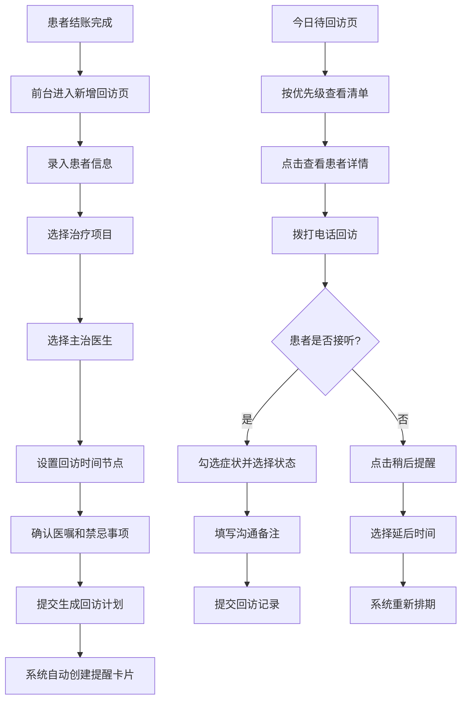

## 1. 产品概述

面向中小型口腔诊所前台护士的回访提醒管理系统，将种植、拔牙、根管治疗后的术后回访从纸质登记转为数字化可追踪清单，提升回访效率与患者满意度。

- 核心目的：解决术后回访漏打、记录混乱、追踪困难的痛点
- 目标用户：口腔诊所前台护士、护士长
- 市场价值：提升诊所服务质量，降低术后纠纷风险，建立标准化回访流程

## 2. 核心功能

### 2.1 用户角色

| 角色 | 注册方式 | 核心权限 |
|------|---------|---------|
| 前台护士 | 系统内置账号 | 新增回访、查看今日清单、录入回访记录、修改提醒时间 |
| 医生 | 系统内置账号 | 查看需复核的回访记录、患者术后情况 |

### 2.2 功能模块

1. **患者回访录入页**：新增回访表单、治疗项目选择、自动生成回访计划、提醒卡片预览
2. **今日待回访清单页**：优先级排序的回访列表、患者详情卡片、回访记录表单、稍后提醒功能
3. **回访记录页**：历史回访记录查询、按患者/日期/治疗类型筛选、记录详情查看

### 2.3 页面详情

| 页面名称 | 模块名称 | 功能描述 |
|---------|---------|---------|
| 患者回访录入 | 患者信息录入 | 姓名、电话、性别、年龄、病历号输入 |
| 患者回访录入 | 治疗项目选择 | 种植/拔牙/根管治疗三种术式下拉选择 |
| 患者回访录入 | 主治医生选择 | 医生列表下拉选择 |
| 患者回访录入 | 回访时间设置 | 术后第1天/3天/7天/14天/30天回访勾选 |
| 患者回访录入 | 医嘱摘要 | 预设医嘱模板快速填充，可手动编辑 |
| 患者回访录入 | 禁忌事项 | 预设禁忌事项模板，可手动编辑 |
| 患者回访录入 | 提醒卡片预览 | 实时展示生成的回访提醒卡片列表 |
| 今日待回访 | 优先级筛选栏 | 高/中/低优先级快速筛选、治疗类型筛选 |
| 今日待回访 | 回访列表卡片 | 患者姓名、术式、回访阶段、医生、优先级标签 |
| 今日待回访 | 患者详情抽屉 | 术式详情、医嘱摘要、禁忌事项、上次沟通记录 |
| 今日待回访 | 回访记录表单 | 疼痛/肿胀/出血/用药情况勾选、状态选择（正常/需医生复核/预约复诊） |
| 今日待回访 | 稍后提醒按钮 | 一键延后2小时/4小时/明天 |
| 回访记录 | 筛选工具栏 | 日期范围、患者姓名、治疗类型、回访状态筛选 |
| 回访记录 | 记录列表 | 患者信息、回访时间、回访结果、操作护士 |
| 回访记录 | 记录详情 | 完整回访问卷、沟通内容、后续处理建议 |

## 3. 核心流程

### 3.1 新增回访流程

前台护士在患者结账后进入"新增回访"页面 → 录入患者基本信息 → 选择治疗项目（种植/拔牙/根管治疗）→ 选择主治医生 → 系统根据术式自动推荐回访时间节点（当天、3天、7天等）→ 护士可调整回访节点 → 查看医嘱摘要和禁忌事项（系统根据术式预设，可编辑）→ 提交后系统自动生成回访提醒卡片 → 卡片进入对应日期的待回访清单

### 3.2 回访执行流程

护士登录系统进入"今日待回访"页面 → 按优先级顺序查看待回访患者 → 点击患者卡片查看详情（术式、医嘱、禁忌、历史记录）→ 拨打患者电话 → 根据沟通结果勾选症状（疼痛/肿胀/出血/用药情况）→ 选择回访状态（正常/需医生复核/预约复诊）→ 填写沟通备注 → 提交回访记录 → 系统自动记录并更新状态

### 3.3 未接听处理流程

护士拨打患者电话未接听 → 点击"稍后提醒"按钮 → 选择延后时间（2小时/4小时/明天）→ 系统重新安排提醒时间 → 延后的回访卡片重新出现在对应时间段的清单中

## 4. 用户界面设计

### 4.1 设计风格

**风格定位**：务实清晰的医疗工作台风格，强调信息的可读性和操作效率，避免过度装饰。

- **主色调**：专业医疗蓝 `#2563EB`（传达专业、信任）
- **辅助色**：
  - 紧急红 `#DC2626`（高优先级、异常状态）
  - 成功绿 `#16A34A`（正常状态、完成）
  - 警示黄 `#D97706`（中优先级、需关注）
  - 中性灰 `#6B7280`（低优先级、次要信息）
- **背景色**：浅灰蓝渐变 `#F8FAFC` → `#F1F5F9`（干净清爽，减轻视觉疲劳）
- **卡片背景**：纯白 `#FFFFFF`，细边框 `#E2E8F0`，柔和阴影
- **按钮样式**：圆角 `8px`，主按钮实色填充，次按钮描边
- **字体**：
  - 标题：思源黑体 CN / Noto Sans SC Bold，20px-28px
  - 正文：思源黑体 CN / Noto Sans SC Regular，14px-16px
  - 辅助文字：12px-13px，灰度 `#6B7280`
- **布局风格**：顶部导航栏 + 左侧菜单（可选）+ 主内容区卡片式布局，信息密度适中
- **图标风格**：线性图标（Lucide/Feather风格），24px标准尺寸，与文字同色
- **卡片设计**：统一圆角 `12px`，hover时微上浮效果（阴影加深），高优先级卡片左边框色条标识

### 4.2 页面设计概述

| 页面名称 | 模块名称 | UI元素 |
|---------|---------|--------|
| 患者回访录入 | 表单区域 | 分区卡片式表单，左侧输入区，右侧实时预览提醒卡片时间轴 |
| 患者回访录入 | 治疗项目选择 | 三栏并排卡片选择器，选中状态有蓝色边框和背景高亮 |
| 患者回访录入 | 回访时间节点 | 可勾选的时间标签组，标签颜色区分优先级 |
| 患者回访录入 | 预览时间轴 | 垂直时间轴展示各回访节点，日期、术式、优先级一目了然 |
| 今日待回访 | 顶部统计栏 | 今日待回访总数、已完成数、未接听数、高优级数量卡片 |
| 今日待回访 | 筛选工具栏 | 优先级标签筛选 + 治疗类型下拉 + 搜索框 |
| 今日待回访 | 患者卡片列表 | 列表式卡片，左色条标识优先级，头像+姓名+术式+回访阶段+状态标签 |
| 今日待回访 | 详情抽屉 | 从右侧滑出，分术式信息、医嘱禁忌、历史记录、回访表单四个区块 |
| 今日待回访 | 回访表单 | 症状复选框组（带图标）、状态单选卡、备注多行输入、提交/稍后提醒双按钮 |
| 回访记录 | 筛选栏 | 日期范围选择器、患者姓名搜索、治疗类型、回访状态多选 |
| 回访记录 | 记录表格 | 斑马纹表格，列：患者、治疗项目、回访日期、状态、护士、操作 |
| 回访记录 | 详情弹窗 | 模态框展示完整回访问卷内容，时间轴式展示多次回访记录 |

### 4.3 响应式设计

- **设计优先级**：桌面端优先（护士工作站 1366×768 及以上）
- **平板适配**：1024px 以下调整侧边栏为可收起，卡片间距缩小
- **移动端适配**：768px 以下顶部导航简化，卡片单列排布，详情抽屉改为全屏覆盖
- **触控优化**：按钮最小高度 44px，点击区域足够，避免误触

### 4.4 交互动效

- 页面加载：卡片依次淡入上浮（staggered 50ms delay）
- 按钮点击：scale 0.96 → 1.0 的回弹效果
- 卡片 hover：translateY -2px + 阴影加深
- 抽屉/弹窗：从边缘滑入 + 背景遮罩淡入
- 状态变更：色条颜色平滑过渡
- 表单提交：加载转圈动画 → 成功绿勾动效
