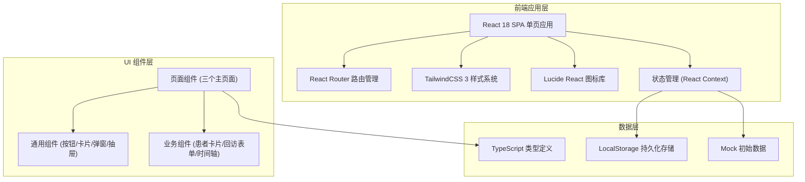

## 1. 架构设计



## 2. 技术描述

- **前端框架**：React@18 + TypeScript@5 + Vite@5
- **初始化工具**：Vite (vite create vite@latest)
- **样式方案**：TailwindCSS@3 + 自定义 CSS 变量
- **路由管理**：React Router DOM@6
- **图标库**：Lucide React
- **状态管理**：React Context + useReducer（轻量级，适合中小型应用）
- **数据持久化**：LocalStorage（无需后端，单站点部署即可运行）
- **构建工具**：Vite@5
- **后端**：无（纯前端方案，使用 LocalStorage 模拟数据库）
- **数据库**：LocalStorage + Mock 初始数据

## 3. 路由定义

| 路由路径 | 页面名称 | 页面用途 |
|---------|---------|---------|
| `/` | 今日待回访 | 首页，展示当天需回访的患者清单，优先级排序，回访操作入口 |
| `/new` | 新增回访 | 录入患者信息、选择治疗项目、生成回访计划 |
| `/records` | 回访记录 | 查询历史回访记录，多条件筛选，查看记录详情 |

## 4. 数据模型

### 4.1 TypeScript 类型定义

```typescript
// 治疗项目类型
type TreatmentType = 'implant' | 'extraction' | 'root_canal';

// 优先级
type Priority = 'high' | 'medium' | 'low';

// 回访状态
type FollowUpStatus = 'pending' | 'completed' | 'delayed' | 'missed';

// 回访结果状态
type ResultStatus = 'normal' | 'need_review' | 'rebook';

// 患者信息
interface Patient {
  id: string;
  name: string;
  phone: string;
  gender: 'male' | 'female';
  age: number;
  medicalRecordNo: string;
}

// 医生信息
interface Doctor {
  id: string;
  name: string;
  title: string;
  department: string;
}

// 回访计划（单个回访节点）
interface FollowUpPlan {
  id: string;
  patientId: string;
  treatmentType: TreatmentType;
  doctorId: string;
  daysAfterSurgery: number; // 术后第几天
  scheduledDate: string; // YYYY-MM-DD
  priority: Priority;
  status: FollowUpStatus;
  createdAt: string;
  instructions: string; // 医嘱摘要
  contraindications: string; // 禁忌事项
}

// 回访症状
interface Symptoms {
  pain: boolean;
  swelling: boolean;
  bleeding: boolean;
  medication: boolean;
  other: string;
}

// 回访记录
interface FollowUpRecord {
  id: string;
  planId: string;
  patientId: string;
  symptoms: Symptoms;
  resultStatus: ResultStatus;
  notes: string; // 沟通备注
  nurseName: string; // 操作护士
  contactSuccess: boolean; // 是否联系成功
  followUpDate: string;
  nextFollowUpDate?: string; // 下次回访时间（延迟时用）
}

// 全局状态
interface AppState {
  patients: Patient[];
  doctors: Doctor[];
  plans: FollowUpPlan[];
  records: FollowUpRecord[];
  currentNurse: string;
}
```

### 4.2 治疗项目预设数据

```typescript
// 各治疗项目的默认回访时间节点和优先级
const TREATMENT_PRESETS: Record<TreatmentType, {
  defaultDays: number[]; // 默认回访天数
  priorityMap: Record<number, Priority>; // 各节点优先级
  defaultInstructions: string;
  defaultContraindications: string;
}> = {
  implant: {
    defaultDays: [0, 3, 7, 14, 30, 90],
    priorityMap: { 0: 'high', 3: 'high', 7: 'medium', 14: 'low', 30: 'low', 90: 'low' },
    defaultInstructions: '1. 术后24小时内冷敷，减轻肿胀\n2. 按医嘱服用抗生素和止痛药\n3. 保持口腔卫生，术后24小时后可轻柔刷牙\n4. 饮食以温凉软食为主\n5. 避免剧烈运动',
    defaultContraindications: '1. 禁止吸烟饮酒\n2. 避免用手术侧咀嚼\n3. 避免食用辛辣、过热、过硬食物\n4. 不要舔舐或吸吮伤口\n5. 如有缝线，避免用手触摸'
  },
  extraction: {
    defaultDays: [0, 3, 7],
    priorityMap: { 0: 'high', 3: 'medium', 7: 'low' },
    defaultInstructions: '1. 咬紧棉球30-40分钟止血\n2. 术后24小时内冷敷\n3. 24小时后可漱口，保持创口清洁\n4. 进食温凉软食\n5. 按医嘱服药',
    defaultContraindications: '1. 24小时内禁止刷牙漱口\n2. 禁止吸烟饮酒\n3. 避免反复吸吮、吐口水\n4. 避免用舌头舔伤口\n5. 禁食辛辣刺激及过热食物'
  },
  root_canal: {
    defaultDays: [1, 7, 14],
    priorityMap: { 1: 'medium', 7: 'medium', 14: 'low' },
    defaultInstructions: '1. 治疗后2小时内禁食\n2. 避免用患侧咀嚼\n3. 注意口腔卫生，饭后漱口\n4. 如有轻微肿痛属正常反应\n5. 按医嘱服用消炎药',
    defaultContraindications: '1. 暂封材料未固化前勿进食\n2. 避免食用过硬粘性食物\n3. 如出现剧烈疼痛请及时复诊\n4. 治疗期间避免烟酒刺激'
  }
};
```

### 4.3 Mock 初始数据

包含以下测试数据：
- 5-8 名患者（覆盖不同治疗类型）
- 3-4 名医生（含种植科、口腔外科、牙体牙髓科）
- 15-20 条回访计划（含今日待回访、已完成、延迟状态）
- 10-15 条回访记录

## 5. 目录结构

```
src/
├── assets/              # 静态资源
├── components/          # 通用组件
│   ├── ui/             # 基础UI组件 (Button, Card, Modal, Drawer, Badge, Tag, Input, Select, Checkbox, Radio)
│   ├── PatientCard.tsx  # 患者回访卡片
│   ├── FollowUpForm.tsx # 回访记录表单
│   ├── Timeline.tsx     # 回访时间轴组件
│   ├── StatsCard.tsx    # 统计卡片
│   └── TopNav.tsx       # 顶部导航栏
├── context/
│   └── AppContext.tsx   # 全局状态管理 Context
├── data/
│   ├── mockData.ts      # 初始 Mock 数据
│   └── presets.ts       # 治疗项目预设配置
├── pages/
│   ├── TodayList.tsx    # 今日待回访页
│   ├── NewFollowUp.tsx  # 新增回访页
│   └── Records.tsx      # 回访记录页
├── types/
│   └── index.ts         # TypeScript 类型定义
├── utils/
│   ├── storage.ts       # LocalStorage 工具函数
│   └── helpers.ts       # 通用辅助函数（日期格式化等）
├── App.tsx
├── main.tsx
└── index.css            # 全局样式 + TailwindCSS 配置
```

## 6. 核心工具函数

| 函数名 | 用途 | 参数 | 返回值 |
|-------|------|------|--------|
| `formatDate` | 格式化日期 | `date: Date \| string, format?: 'full' \| 'date' \| 'time'` | `string` |
| `addDays` | 日期加减天数 | `date: Date, days: number` | `Date` |
| `getTodayStr` | 获取今日日期字符串 | 无 | `string (YYYY-MM-DD)` |
| `generateId` | 生成唯一ID | 无 | `string` |
| `getPriorityLabel` | 获取优先级中文标签 | `priority: Priority` | `string` |
| `getTreatmentLabel` | 获取治疗项目中文名 | `type: TreatmentType` | `string` |
| `getStatusLabel` | 获取回访状态中文名 | `status: FollowUpStatus` | `string` |
| `getResultLabel` | 获取回访结果中文名 | `result: ResultStatus` | `string` |
| `calculateAge` | 根据生日计算年龄 | `birthDate: string` | `number` |
| `createFollowUpPlans` | 根据治疗项目生成回访计划 | `patientId, treatmentType, doctorId, surgeryDate` | `FollowUpPlan[]` |
